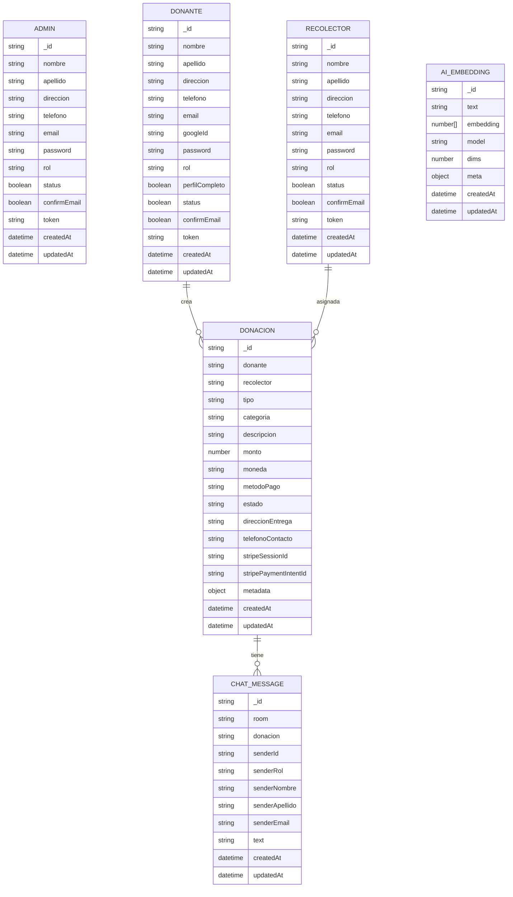

# Diseño de colecciones MongoDB

```mermaid
erDiagram
  ADMIN {
    string _id
    string nombre
    string apellido
    string direccion
    string telefono
    string email
    string password
    string rol
    boolean status
    boolean confirmEmail
    string token
    datetime createdAt
    datetime updatedAt
  }

  DONANTE {
    string _id
    string nombre
    string apellido
    string direccion
    string telefono
    string email
    string googleId
    string password
    string rol
    boolean perfilCompleto
    boolean status
    boolean confirmEmail
    string token
    datetime createdAt
    datetime updatedAt
  }

  RECOLECTOR {
    string _id
    string nombre
    string apellido
    string direccion
    string telefono
    string email
    string password
    string rol
    boolean status
    boolean confirmEmail
    string token
    datetime createdAt
    datetime updatedAt
  }

  DONACION {
    string _id
    string donante
    string recolector
    string tipo
    string categoria
    string descripcion
    number monto
    string moneda
    string metodoPago
    string estado
    string direccionEntrega
    string telefonoContacto
    string stripeSessionId
    string stripePaymentIntentId
    object metadata
    datetime createdAt
    datetime updatedAt
  }

  CHAT_MESSAGE {
    string _id
    string room
    string donacion
    string senderId
    string senderRol
    string senderNombre
    string senderApellido
    string senderEmail
    string text
    datetime createdAt
    datetime updatedAt
  }

  AI_EMBEDDING {
    string _id
    string text
    number[] embedding
    string model
    number dims
    object meta
    datetime createdAt
    datetime updatedAt
  }

  DONANTE ||--o{ DONACION : "crea"
  RECOLECTOR ||--o{ DONACION : "asignada"
  DONACION ||--o{ CHAT_MESSAGE : "tiene"
```
